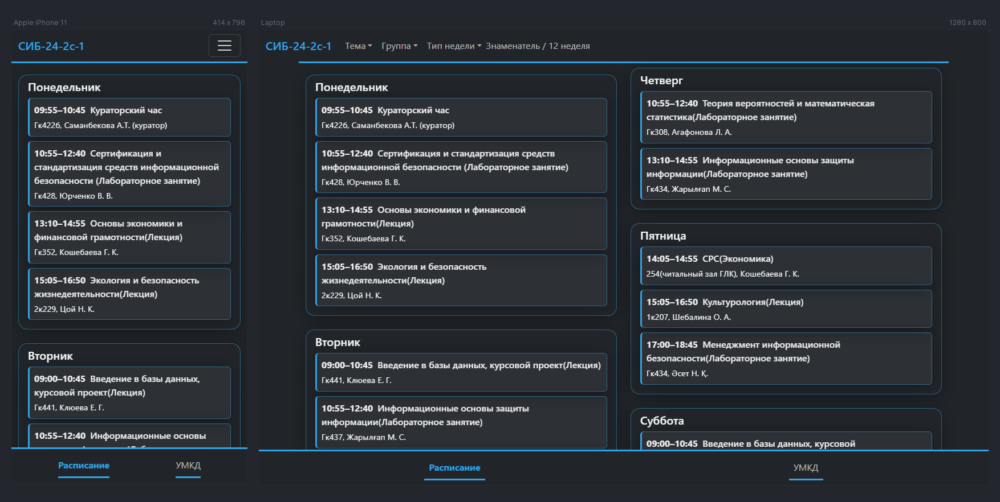
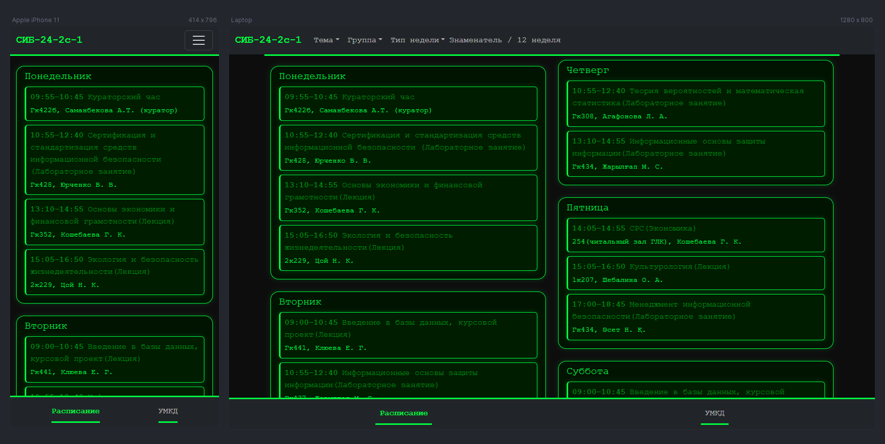
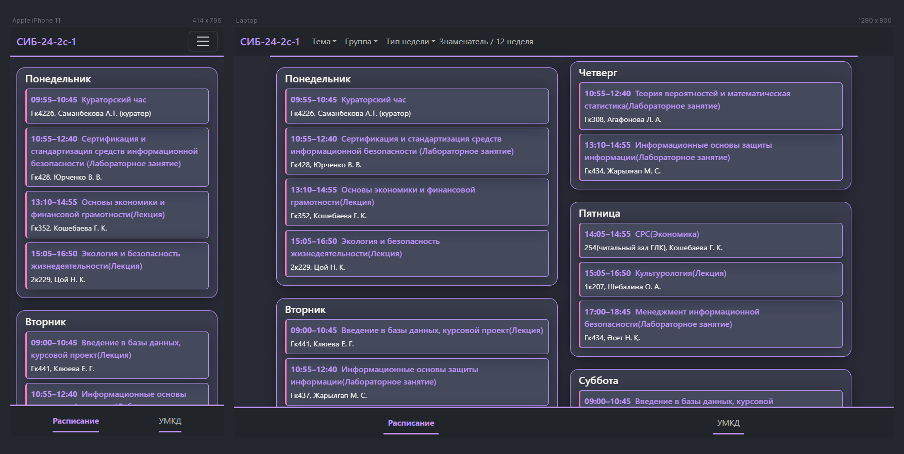

# 🎓 Univer KSTU PWA

Современное, отзывчивое и тематизируемое веб-приложение для составления расписания занятий. Разработано с учетом подхода, ориентированного на мобильные устройства, с использованием **Bootstrap 5**, оптимизировано для повышения производительности и преобразуется в нативное приложение с помощью технологии **PWA**.

🔗 **[Live Demo](https://wopzy.github.io/univer-kstu)**

---

## ✨ Features

- **📱 Полностью адаптивный:** Отлично смотрится на настольных компьютерах, планшетах и мобильных устройствах.
- **🎨 Несколько тем:**
  - ☀️ **Minimal (Light):** Тема по-умолчанию, светлая с акцентом на голубой цвет.
  - 🌑 **Octopus (Dark):** Темная тема.
  - 📟 **Matrix:** Моно шрифт с акцентом на зеленый цвет.
  - 🧛 **Dracula:** Универсальная тема оформления практически для всего.
  - ⬛ **OLED (black):** True black background.
- **💾 PWA Support:** Может быть установлен на домашние экраны iOS / Android и работать в автономном режиме.
- **⚡ Dynamic Rendering:** Контент генерируется с помощью JavaScript, сохраняя чистоту HTML.
- **⚙️ Smart Settings:** Запоминает выбранную вами тему (`localStorage") и автоматически определяет системные настройки, недели, дни и уроки.

---

## 🛠 Технический стек и инструменты

Этот проект был улучшен с использованием инструментов из **GitHub Student Developer Pack**:

| Категория | Используемые инструменты |
|----------|------------|
| **Core** | HTML5, CSS3 (Variables), JavaScript (ES6+) |
| **Framework** | **Bootstrap 5** |
| **Editor** | **VS Code** + GitHub |
| **Design/Prototyping** | **Bootstrap Studio** |
| **Testing** | **Polypane** (для тестирования адаптивности и специальных возможностей) |
| **AI Assist** | **GitHub Copilot** (для генерации и рефакторинга логики) |
| **Hosting** | **GitHub Pages** |

---

## 📸 Скриншоты

| Minimal | Octopus | Matrix | Dracula |
|:---:|:---:|:---:|:---:|
|  |  |  |  |

> *Примечание: Скриншоты создаются с помощью Polypane.*

---
🚀 Educational materials provided for student convenience only. All rights belong to their respective owners.
